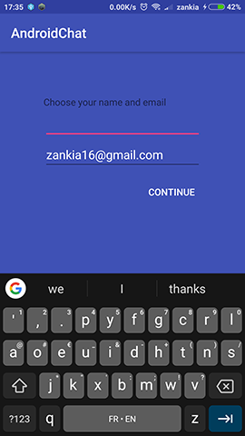
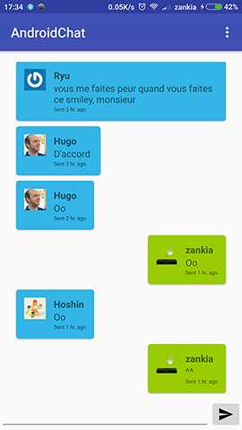
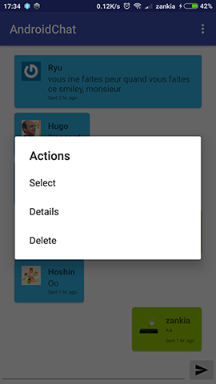
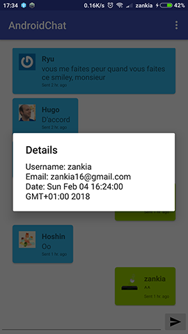

# AndroidChat
Android application for chatting

## Features
* realtime chat
* timestamp handling
* awesome look

## Installation
### APK
The apk is available in [the latest release](https://github.com/zankia/AndroidChat/releases)

### IDE
* import the project
* connect to firebase realtime database
* use gradle wrapper to build

## Screenshot

